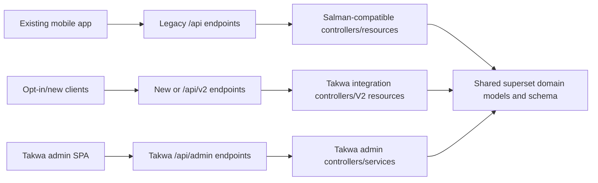

# Salman API Contract + Takwa Feature Integration Plan

## 1. Objective

Use `takwa-backend/unitill-backend` as the only Git repository and deployment
source, while:

1. preserving the existing Salman mobile API contract exactly for every endpoint
   already present in Salman;
2. retaining Takwa's backend integrations, admin features, localization, and
   frontend work;
3. adding Salman-only business features that are missing from Takwa;
4. resolving the incompatible university, coupon, ad, authentication, and
   migration implementations without duplicating tables or changing legacy JSON;
5. implementing and delivering all work on a dedicated Takwa branch.

This document is a plan only. The only repository change made with this plan is
this document.

## 2. Repositories and Git baseline

| Role | Path | State |
|---|---|---|
| Salman compatibility source | `salman-backend/unitill-main` | Unpacked source tree; no `.git` directory |
| Takwa target repository | `takwa-backend/unitill-backend` | Git repository with `origin` configured |
| Target base | `origin/main` | Commit `759ea998f457172d41f32a3556bdacb7884e8c1c` |
| Working branch | `integration/salman-contract-takwa-features` | Created from the current `origin/main` |

Because the Salman directory has no Git history, it cannot be merged or
cherry-picked. It must be treated as a reference implementation and imported
through reviewed, file-level patches.

Takwa's `origin/main` already contains the Takwa feature history, including:

- V2 OTP authentication and university administration;
- postcode and vehicle lookup;
- location privacy work;
- Stripe listing payments and coupons;
- soft account deletion;
- ad and chat report administration;
- account settings and personal-data export;
- five-language API/dashboard localization;
- React dashboard pages for reports, coupons, and universities;
- production SPA routing and CORS changes.

## 3. Non-negotiable compatibility rule

An endpoint is a **legacy endpoint** when the same HTTP method and URI exists in
`salman-backend/unitill-main/routes/api.php`.

For every legacy endpoint, Salman is the source of truth for all observable
behavior:

- HTTP status codes;
- JSON envelope (`status`, `data`, and optional `message`);
- field names and nesting;
- fields that are omitted versus present with `null`;
- string, boolean, integer, decimal, and timestamp types;
- pagination shape;
- English and Arabic response/validation text;
- validation rules and error keys;
- authentication requirements;
- token payload and V1 token lifetime;
- resource output;
- important state transitions that the mobile application relies on.

Do not assume that adding fields is harmless. The requirement is strict response
compatibility, so existing responses must not gain, lose, rename, or reinterpret
fields unless the mobile application is explicitly upgraded first.

Takwa behavior that conflicts with a Salman legacy response must be exposed
through a new endpoint or a versioned resource. It must not silently replace the
legacy behavior.

## 4. Current comparison findings

Static comparison of `app`, `config`, `database`, `routes`, and `tests` found:

- Salman: 287 files in those areas;
- Takwa: 312 files in those areas;
- 8 implementation files exist only in Salman;
- 28 implementation/migration files exist only in Takwa;
- 68 common application files differ;
- neither copy has meaningful feature/contract tests; both only contain the
  default example tests;
- neither copy currently has `vendor/`, so runtime route/test verification
  requires `composer install`;
- both implementations changed the same high-risk controllers and models rather
  than implementing isolated modules;
- the two implementations contain incompatible migrations for both
  `university_domains` and `coupons`/`coupon_redemptions`.

This is therefore a behavioral reconciliation, not a directory-copy operation.

## 5. Target architecture



The legacy and Takwa paths may share models and domain services, but they must
use separate response presenters when their JSON contracts differ.

## 6. Feature and collision decisions

| Area | Salman behavior to preserve | Takwa feature to retain | Integration decision |
|---|---|---|---|
| V1 authentication | Existing login/register/refresh/biometric responses, messages, token payload, and 60-minute access-token default | Soft-deleted account restoration and user blocking | Keep Salman V1 controller contract; call Takwa domain services internally only when the resulting response is identical |
| V2 authentication | Does not exist in Salman | Two-step OTP login and 30-day access token | Retain under `/api/v2/*`; do not route V1 mobile calls into it |
| Student verification | Term-based re-verification, due dates, OTP endpoints, notification command | University/domain admin and V2 login OTP | Add Salman lifecycle fields and endpoints; use one unified university/domain model |
| University domains | Direct active UK-domain allowlist with subdomain matching | `universities` parent table, domain status, admin CRUD/UI | Keep Takwa parent model; make `UniversityDomain::allows()` preserve Salman registration behavior |
| Public ad resources | Salman `AdResource` and `AdDetailResource` fields, including `subtitle`, verification, raw location fields, grouped multiselect attributes, and publish-time fallback | Guest field hiding, approximate location, privacy settings | Legacy resources remain Salman-exact; use V2 presenters for privacy/masked variants |
| Ad listing/filtering | Salman typed filter/post engine, multiselect values, radius/distance support, Salman sort labels and response metadata | Postcode, vehicle plate, region, payment fields | Salman query/output contract wins; store Takwa-only fields additively and expose new lookup/payment flows separately |
| Ad creation/publishing | Existing request rules, success messages, payload, listing fee fields, and state transitions | Coupon redemption, free listing quota, Stripe PaymentIntent, sell-again | Keep legacy flow unchanged; expose the Takwa paid-publication flow through versioned ad endpoints |
| Coupon validation | Salman request limit, messages, reason payload, field names (`discount`, `total`, etc.), and `percent` type | Takwa admin CRUD, min amount, max discount, redemption amounts, Stripe use | Use a superset schema and adapter; legacy validation presenter remains Salman-exact; Takwa payment preview gets a V2 endpoint |
| Account deletion | Salman endpoint response | Reversible soft deletion/restoration | Use Takwa deletion service behind the legacy controller, returning Salman-exact JSON |
| Data export | Salman `POST account/data-request` response | Takwa reusable exporter, throttling, inline download | Preserve Salman POST response; retain new GET download; throttle only if its 429 contract is explicitly tested/accepted |
| Account/privacy settings | No Salman endpoints | Takwa GET/PUT settings endpoints | Retain as additive routes; do not add a `settings` object to legacy `UserResource` |
| Chat/report moderation | Salman chat endpoint responses and re-verification gating | Takwa chat report reasons/admin CRUD and trusted-user privacy | Keep legacy chat presenter/messages; retain additive report/admin endpoints; version behavior that adds new legacy errors |
| API localization | Salman legacy `lang` behavior, primarily English/Arabic literals | Takwa `en/ar/fr/es/zh` translations and middleware | Do not prepend locale middleware globally to legacy routes; apply it to V2/additive routes and dashboard APIs |
| Dashboard | Salman has no extra report/coupon/university pages | Takwa React pages and localized dashboard | Keep Takwa frontend as baseline and update API calls only where reconciliation changes an integration route |
| Expiring ads | Salman `ads:expire-old` and scheduled state/reason update | Takwa `ads:expire`, dry-run, hourly scheduling | Share one expiry service, keep command aliases if operational scripts use either name, and schedule one non-overlapping job |
| Deployment | Salman backend route behavior | Takwa SPA fallback, production build, split-domain CORS | Keep Takwa deployment setup; configure origins through environment variables |

## 7. Routes

### 7.1 Legacy route set

The full Salman route table in `routes/api.php` must remain available with the
same middleware and methods. The most sensitive families are:

- public settings, languages, home, categories, cities, ads, ad details, report
  reasons, and legal affairs;
- V1 register/login/refresh/student verification/password reset;
- all existing `/api/admin/*` routes that Salman already defines;
- ad creation, draft, image upload, publish, reporting, and My Ads actions;
- orders, ratings, favorites, sessions, biometric tokens, and FCM/device
  registration;
- notification inbox;
- profile, deletion, data request, security, trusted seller, and contact;
- conversations and messages;
- Salman re-verification and coupon validation routes.

Generate a route manifest from Salman before implementation and compare it with
the final Takwa route manifest. The final manifest may contain additional Takwa
routes, but no Salman method/URI/middleware combination may disappear or change.

### 7.2 Takwa-only routes to retain

These do not collide with Salman routes and can remain additive:

- `POST /api/stripe/webhook`
- `GET /api/chat-report-reasons`
- `POST /api/v2/login`
- `POST /api/v2/login/verify-otp`
- `POST /api/v2/login/resend-otp`
- `POST /api/v2/auth/refresh`
- `GET|POST|PUT|DELETE /api/admin/universities...`
- `GET|POST|PUT|DELETE /api/admin/coupons...`
- `GET|PUT /api/admin/ad-reports...`
- `GET|PUT /api/admin/chat-reports...`
- `POST /api/ads/{id}/payment/complete`
- `POST /api/my-ads/{id}/sell-again`
- `GET /api/account/data-download`
- `GET|PUT /api/account/settings`
- `GET /api/vehicles/lookup`
- `GET /api/postcode/lookup`

### 7.3 Conflicting Takwa flows that need versioning

Takwa changes the behavior and response of existing ad and coupon endpoints.
Keep the Salman routes unchanged and add opt-in endpoints for the Takwa flow:

- `POST /api/v2/ads`
- `POST /api/v2/ads/draft`
- `POST /api/v2/ads/{id}/publish`
- `POST /api/v2/ads/{id}/payment/complete`
- `POST /api/v2/coupons/validate`

These endpoints can return PaymentIntent/client-secret, publication, coupon,
privacy, or localization fields without changing the mobile contract on V1.
Feature flags should allow the V2 payment flow to be disabled independently.

## 8. Detailed implementation phases

### Phase 0 — Branch and evidence preservation

1. Work only on `integration/salman-contract-takwa-features`.
2. Never copy `.env`, storage contents, caches, built dependencies, or generated
   runtime files from Salman.
3. Record the Salman snapshot checksum or archive checksum in the eventual PR so
   reviewers know which source tree supplied the compatibility behavior.
4. Save the pre-change Takwa route manifest and schema dump as review artifacts.
5. Do not edit or delete old, potentially deployed Takwa migrations. Use new
   forward-only reconciliation migrations.

### Phase 1 — Freeze the Salman contract before porting features

Create a real contract test suite in Takwa before changing application behavior.

Suggested structure:

```text
tests/
  Feature/
    Contracts/
      PublicApiContractTest.php
      AuthV1ContractTest.php
      AdContractTest.php
      ProfileAndSecurityContractTest.php
      ConversationContractTest.php
      NotificationFavoriteRatingContractTest.php
      AdminContractTest.php
    Integrations/
      AuthV2Test.php
      PostcodeLookupTest.php
      VehicleLookupTest.php
      ListingPaymentTest.php
      StripeWebhookTest.php
      AccountSettingsTest.php
  Fixtures/
    contracts/
```

For each Salman endpoint, cover:

1. success;
2. validation failure;
3. unauthenticated request;
4. missing resource;
5. forbidden/ownership failure where applicable;
6. English response;
7. Arabic response;
8. pagination and empty collection;
9. nullable/optional fields;
10. exact resource data types.

Normalize only truly dynamic values such as IDs, signed tokens, timestamps, and
temporary file URLs. Do not normalize field names, messages, status codes, nulls,
or numeric/string types.

High-priority golden-master assertions:

- `AdResource`, `AdDetailResource`, `MyAdResource`, and `UserResource`;
- V1 login, register, refresh, biometric login, verification, and password reset;
- ad list/detail/create/draft/publish;
- `coupons/validate`;
- profile show/update and account security;
- conversation list/detail/message/report;
- favorites, ratings, notifications, orders;
- API exception and FormRequest error envelope.

Use MySQL for integration tests because the code contains MySQL-specific enum,
`FIELD`, casts, and raw distance SQL. SQLite alone will produce false confidence.

### Phase 2 — Reconcile database schema using additive migrations

#### 2.1 Student verification and V2 login OTP

Add a new migration that conditionally adds missing user columns:

- `student_verified_at`
- `student_reverify_due_at`
- `reverify_notified_at`
- `login_otp`
- `login_otp_expires_at`
- `login_otp_sent_at`

Retain Takwa soft-delete and privacy/notification columns. Add all corresponding
casts to the merged `User` model.

#### 2.2 Universities and domains

Keep Takwa's `universities` table and relation. Reconcile
`university_domains` into a superset with:

- `university_id`;
- `domain`;
- Takwa `status`;
- Salman-compatible active semantics;
- a unique normalized domain.

Do not create a second `university_domains` table. Update the Salman domain
seeder to create/find a parent university and then insert related domains.
Backfill any unparented domains into a safe university record before enforcing a
non-null foreign key.

Implement `UniversityDomain::allows(string $email)` using an indexed exact/parent
domain lookup, requiring both the domain and parent university to be active. Its
boolean result and Salman registration validation message must remain unchanged.

#### 2.3 Coupon schema

Keep one `coupons` and one `coupon_redemptions` table. Reconcile them as a
superset:

- preserve Salman fields: `max_uses`, `max_uses_per_user`, `used_count`;
- retain Takwa fields: `max_discount`, `min_amount`, redemption amount audit
  columns;
- standardize the API-facing legacy type as `percent|fixed`;
- convert existing Takwa `percentage` rows to `percent`;
- keep Takwa admin inputs compatible by mapping `percentage` to `percent` at its
  boundary if necessary;
- retain per-user default of one use;
- use transactions/row locking for counters;
- do not keep a database uniqueness rule that contradicts a configured
  `max_uses_per_user > 1`; use an index plus transactional enforcement;
- backfill both old counters from redemption rows and then update them together
  in the domain service.

The legacy `CouponController` must still output Salman's exact keys:
`code`, `type`, `value`, `listing_fee`, `discount`, `total`,
`formatted_discount`, and `formatted_total`.

#### 2.4 Category filter engine

Takwa already adds `date` and `multiselect` input types. Add Salman fields:

- `filter_control`
- `post_control`
- `config`
- `is_filterable`
- `is_postable`

Drop the old one-value-per-ad/definition unique index so multiselect values can
be stored as multiple rows. Add a non-unique lookup index instead. Verify both
fresh migration and upgrade from the current Takwa schema.

#### 2.5 Ads and payments

Retain the superset of:

- Salman location, publication, expiration, and status fields;
- Takwa `license_plate`, `region`, listing fee, payment status,
  `stripe_payment_intent_id`, and free-listing fields;
- Takwa soft deletes.

Add indexes for public status/expiry queries, owner/status queries, payment intent
lookup, and latitude/longitude access where justified by query plans.

#### 2.6 Migration verification

Test both:

1. a clean database running every migration from zero;
2. a copy of the current Takwa schema/data running only the new migrations.

Run seeders twice to confirm idempotency. Specifically verify university/domain,
coupon, language, settings, category attribute, and permission seeders.

### Phase 3 — Merge domain models and services

#### 3.1 Salman-only files to add

- `app/Console/Commands/ExpireOldAds.php`
- `app/Console/Commands/RequireStudentReverification.php`
- `app/Support/GeoDistance.php`
- `app/Support/StudentTerm.php`
- the Salman student/filter reconciliation migrations, rewritten as new
  forward-only migrations rather than copied with the original timestamps;
- an adapted `UniversityDomainSeeder`.

#### 3.2 Takwa-only application files to retain

Retain the Takwa controllers/services/resources for:

- V2 authentication;
- account settings;
- ad/chat/coupon/university administration;
- postcode and vehicle lookup;
- Stripe webhook and listing payments;
- account deletion and data export;
- coupon redemption;
- location approximation;
- report reason support;
- payment handling.

#### 3.3 Models requiring manual superset merges

Do not copy either version wholesale. Manually merge:

- `app/Models/User.php`: keep `SoftDeletes`, Takwa privacy/login OTP fields, and
  Salman student re-verification methods/casts;
- `app/Models/Ad.php`: keep `SoftDeletes`, Takwa payment/plate/region fields, and
  Salman publication, expiration, scope, relation, and status behavior;
- `app/Models/UniversityDomain.php`: Takwa relation plus Salman `allows()`;
- `app/Models/Coupon.php`: compatibility methods plus Takwa payment/admin
  calculations;
- `app/Models/CouponRedemption.php`: all relations and audit fields;
- `app/Models/CategoryAttributeDefinition.php`: Salman filter/post controls plus
  Takwa input types;
- `app/Models/Conversation.php`: preserve Salman mobile behavior while retaining
  Takwa moderation fields;
- related casts/fillable lists must cover the reconciled schema.

#### 3.4 Shared services

Extract or retain domain services for:

- account deletion/restoration;
- personal-data export;
- coupon preview/redemption;
- listing payment creation/completion;
- ad expiration;
- postcode and vehicle provider access.

Controllers should adapt service results into either a Salman legacy presenter
or a Takwa/V2 presenter. Services must not return HTTP responses.

### Phase 4 — Restore Salman-exact legacy controllers and resources

Use Salman as the starting point for common legacy controllers, then add Takwa
domain calls without changing their returned response.

High-risk manual merges:

- `AuthController`
- `AdController`
- `ConversationController`
- `CouponController`
- `MyAdController`
- `UserController`
- `AccountSecurityController`
- ad report, favorite, order, notification, rating, and device controllers
- all changed FormRequests

Legacy resource classes must match Salman:

- `app/Http/Resources/AdResource.php`
- `app/Http/Resources/AdDetailResource.php`
- `app/Http/Resources/MyAdResource.php`
- `app/Http/Resources/UserResource.php`

Create V2 resource classes where Takwa needs a different representation, for
example:

```text
app/Http/Resources/V2/AdResource.php
app/Http/Resources/V2/AdDetailResource.php
app/Http/Resources/V2/UserResource.php
```

Specific contract decisions:

- keep Salman's `published_at ?? created_at` legacy fallback;
- keep Salman's complete legacy ad detail fields for guests;
- keep Salman's grouped multiselect attributes;
- keep Salman's full `UserResource` rating/trusted-seller and student lifecycle
  fields;
- do not inject Takwa's privacy `settings` object into legacy profile output;
- do not mask/remove legacy postcode or coordinates;
- apply Takwa privacy and guest-field hiding only in V2 presenters;
- keep Salman's literal English/Arabic response text on legacy routes.

### Phase 5 — Integrate Takwa features without legacy response changes

#### 5.1 V2 OTP authentication

- Retain Takwa `Api/V2/AuthController`.
- Keep V2 token configuration separate from V1.
- Remove any production default/fixed OTP; permit a fixed code only in testing
  environments.
- Add resend throttling and one-time consumption tests.
- Verify blocked, soft-deleted/reactivated, biometric, expired, replayed, and
  wrong-code cases.

#### 5.2 Postcode integration

- Retain `PostcodeController` and `PostcodeService`.
- Add connection/read timeouts, retry policy, and `Http::fake()` tests.
- Normalize UK postcodes and map the city without requiring an exact
  case-sensitive translation match.
- Preserve the additive endpoint's response and distinguish invalid postcode
  from provider outage.
- Never call the provider during normal ad-resource serialization.

#### 5.3 Vehicle integration

- Retain `VehicleLookupController` and `VehicleApiService`.
- Move provider credentials to environment-only configuration.
- Test not-found, provider failure, mapping fallback, and plate normalization.
- Store `license_plate` and mapped vehicle attributes additively.
- Do not add vehicle fields to legacy response resources unless they already
  appear through Salman's existing dynamic `attributes` contract.

#### 5.4 Stripe/listing payments

- Retain `StripeService`, `ListingPaymentService`, webhook verification, free
  listing quota, and sell-again behavior.
- Put the paid publication start flow on V2 ad endpoints.
- Make webhook completion idempotent and transactional.
- Verify amount, currency, ad ownership/metadata, and PaymentIntent identity
  before publishing.
- Do not trust a client-only "payment complete" signal.
- Ensure repeated webhooks or verification calls cannot double-redeem a coupon
  or republish/extend an ad twice.
- Keep the legacy Salman ad publication payload and status behavior unchanged.

#### 5.5 Account deletion/export/settings

- Use Takwa soft-delete/restore services behind the Salman deletion endpoint,
  preserving the Salman response.
- Keep the Takwa download and settings routes additive.
- Prevent settings/privacy changes from changing legacy `UserResource`.
- Apply a named rate limiter to expensive export routes, with explicit contract
  tests for the 429 envelope and headers.

#### 5.6 Reports and dashboard administration

- Retain Takwa ad report, chat report, coupon, and university controllers.
- Keep Takwa React pages:
  `AdReportsPage.tsx`, `ChatReportsPage.tsx`, `CouponsPage.tsx`, and
  `UniversitiesPage.tsx`.
- Reconcile permissions in `RolePermissionSeeder`.
- Test that a fresh permission seed grants the intended admin navigation and API
  permissions without deleting custom production roles.

### Phase 6 — Middleware, exceptions, localization, and deployment

1. Remove the global API prepend of `SetApiLocale`.
2. Register it as a named middleware and apply it to V2/additive APIs that use
   Takwa translation files.
3. Leave Salman legacy locale/message behavior unchanged.
4. Keep the `HttpResponseException` pass-through fix so FormRequest and throttle
   responses are not converted into 500 responses.
5. Preserve the Salman API exception envelope for authentication, validation,
   404, 405, and server errors.
6. Retain Takwa's SPA fallback and split-domain deployment behavior.
7. Keep CORS origins environment-driven; test allowed and rejected origins.
8. Rebuild the frontend only after backend route reconciliation.

### Phase 7 — Security gate

Static inspection found tracked PHP configuration/helper code containing
hard-coded or default third-party credentials. Before deployment:

1. remove all credential defaults and hard-coded tokens from source;
2. use environment variables or the deployment secret store;
3. rotate every exposed credential, because removing it from the latest commit
   does not invalidate the old value;
4. scan the branch and Git history with a secret scanner;
5. ensure `.env`, Firebase credentials, database dumps, and storage exports are
   not committed;
6. keep sanitized placeholders in `.env.example`.

Treat credential rotation as a separate, clearly labeled commit so it is easy to
audit.

### Phase 8 — Verification

#### Backend

Run:

```bash
composer install
php artisan optimize:clear
php artisan migrate:fresh --seed --env=testing
php artisan route:list
php artisan test
```

Also run:

- PHP formatter/static analysis configured by the project;
- an upgrade migration against a Takwa schema snapshot;
- queue and scheduler smoke tests;
- storage upload/URL tests;
- mail, Firebase, postcode, vehicle, and Stripe tests using fakes;
- webhook signature and idempotency tests;
- coupon concurrency tests;
- authorization tests for every new admin permission.

#### Frontend

Run:

```bash
cd frontend
npm ci
npm run build
```

Then smoke-test login, navigation, reports, coupons, universities, settings, and
localized pages against the reconciled backend.

#### Mobile contract comparison

For every Salman legacy endpoint, compare old and new responses after
normalizing only approved dynamic values. The comparison must fail on:

- missing or additional keys;
- different nesting;
- different null/omission behavior;
- different scalar types;
- different status codes;
- different messages;
- different pagination metadata.

Run the final contract suite with both `lang: en` and `lang: ar`, authenticated
and unauthenticated where relevant.

### Phase 9 — Deployment and rollback

1. Deploy the branch to staging with a production-like MySQL copy.
2. Back up the production database before applying reconciliation migrations.
3. Run migrations and data backfills with counts logged before and after.
4. Run legacy mobile smoke tests first.
5. Run Takwa integration/dashboard smoke tests second.
6. Enable external integrations through feature flags:
   - V2 OTP auth;
   - postcode lookup;
   - vehicle lookup;
   - listing payments;
   - V2 privacy presenters.
7. Roll out one integration at a time and monitor HTTP 4xx/5xx rates, provider
   errors, payment mismatches, and queue failures.
8. Roll back application code by reverting the release commit. Database
   migrations should be additive so old code can continue to run during a code
   rollback; do not depend on destructive down migrations in production.

## 9. File-level work list

### Preserve Salman contract in these shared files

- `routes/api.php`
- `bootstrap/app.php`
- `app/Providers/RouteServiceProvider.php`
- changed API controllers under `app/Http/Controllers/Api`
- changed FormRequests under `app/Http/Requests`
- the four changed mobile resources
- `app/Support/AdFilters.php`
- `app/Support/AdSort.php`
- `app/Services/ChatService.php`
- `config/mobile_auth.php`

### Retain Takwa integration implementations

- `app/Http/Controllers/Api/V2/AuthController.php`
- `app/Http/Controllers/Api/PostcodeController.php`
- `app/Http/Controllers/Api/VehicleLookupController.php`
- `app/Http/Controllers/Api/StripeWebhookController.php`
- `app/Http/Controllers/Api/AccountSettingsController.php`
- Takwa-only dashboard controllers
- `app/Services/AccountDeletionService.php`
- `app/Services/PersonalDataExportService.php`
- `app/Services/PostcodeService.php`
- `app/Services/VehicleApiService.php`
- `app/Services/StripeService.php`
- `app/Services/ListingPaymentService.php`
- `app/Services/CouponRedemptionService.php`
- `app/Traits/HandlesListingPayments.php`
- Takwa API translation files and dashboard frontend

### Manual merge only; never wholesale-copy

- `app/Models/User.php`
- `app/Models/Ad.php`
- `app/Models/UniversityDomain.php`
- `app/Models/Coupon.php`
- `app/Models/CouponRedemption.php`
- `app/Models/CategoryAttributeDefinition.php`
- `app/Models/Conversation.php`
- `app/Http/Controllers/Api/AuthController.php`
- `app/Http/Controllers/Api/AdController.php`
- `app/Http/Controllers/Api/ConversationController.php`
- `app/Http/Controllers/Api/MyAdController.php`
- `app/Http/Controllers/Api/UserController.php`
- `app/Http/Requests/RegisterRequest.php`
- `app/Http/Requests/StoreAdRequest.php`
- category, attribute, language, permission, setting, university, and coupon
  seeders

### Frontend policy

No frontend source file exists only in Salman. Keep Takwa as the frontend
baseline. Do not overlay Salman's common React files over Takwa, because that
would remove Takwa localization and admin integrations. Make only the API client
and UI adjustments required by the reconciled backend.

## 10. Recommended commit sequence

Keep commits small and independently reviewable:

1. `docs: add Salman contract and Takwa integration plan`
2. `test: freeze Salman legacy API contracts`
3. `feat: add forward-only reconciliation migrations`
4. `feat: merge superset domain models and services`
5. `feat: restore Salman-compatible legacy API behavior`
6. `feat: expose Takwa auth lookup privacy and payment integrations`
7. `feat: reconcile admin APIs permissions and dashboard`
8. `security: remove embedded credentials and harden integrations`
9. `test: add migration integration and end-to-end verification`

Do not mix generated frontend build output, dependency lock changes, schema
changes, and controller reconciliation in one commit.

## 11. Branch and push workflow

The branch for this work is:

```text
integration/salman-contract-takwa-features
```

Workflow:

```bash
git fetch origin
git switch integration/salman-contract-takwa-features
git status
# implement and verify in the commit sequence above
git push -u origin integration/salman-contract-takwa-features
```

Do not force-push after review begins. Open a pull request into `main` and require
the contract suite, backend suite, migration checks, frontend build, and secret
scan to pass before merge.

## 12. Definition of done

The reconciliation is complete only when all of the following are true:

- every Salman method/URI still exists;
- every Salman legacy contract test passes without approved response changes;
- the Salman student re-verification and filter/post engine work in Takwa;
- Takwa V2 auth, university admin, postcode, vehicle, Stripe, coupons, soft
  deletion, exports, settings, reports, localization, and dashboard work;
- fresh and upgrade migrations both pass;
- coupon and university data are migrated without duplicate tables or lost rows;
- legacy V1 and new V2 resources are intentionally separated where required;
- no credentials are embedded in tracked source;
- the dashboard builds successfully;
- staging mobile regression passes in English and Arabic;
- the final implementation commits are pushed to
  `origin/integration/salman-contract-takwa-features`;
- a pull request documents response compatibility evidence, migration counts,
  feature-flag state, and rollback steps.

